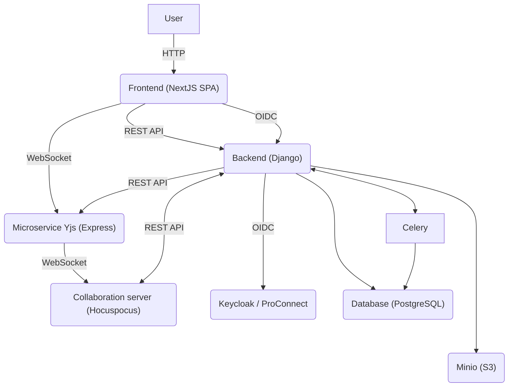

## Architecture

### Global system architecture

```mermaid
flowchart TD
    User -- HTTP --> Front("Frontend (NextJS SPA)")
    Front -- REST API --> Back("Backend (Django)")
    Front -- WebSocket --> Yserver("Microservice Yjs (Express)") -- WebSocket -->  CollaborationServer("Collaboration server (Hocuspocus)") -- REST API <--> Back
    Front -- OIDC --> Back -- OIDC ---> OIDC("Keycloak / ProConnect")
    Back -- REST API --> Yserver
    Back --> DB("Database (PostgreSQL)")
    Back <--> Celery --> DB
    Back ----> S3("Minio (S3)")
```

### Architecture decision records

- [ADR-0001-20250106-use-yjs-for-docs-editing](./adr/ADR-0001-20250106-use-yjs-for-docs-editing.md)