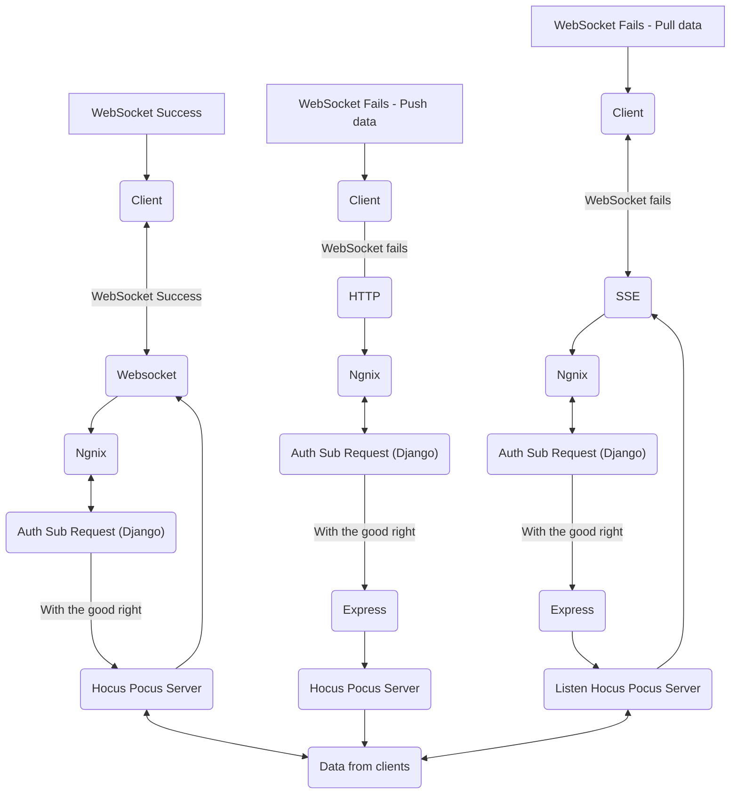

# Architecture Overview

This architecture showcases different ways for clients to interact with a **Hocus Pocus Server** (a [Y.js](https://github.com/yjs/yjs) provider) through either WebSockets, HTTP fallbacks, or Server-Sent Events (SSE) when WebSockets are not available.

**Main Components**:

- **Client**: The front-end application or user agent.
- **Nginx**: A reverse proxy handling incoming requests, forwarding them to the appropriate services, and managing SSL/TLS termination if needed.
- **Auth Sub Request (Django)**: Handles authentication/authorization, ensuring requests have valid credentials or permissions.
- **Hocus Pocus Server**: The core collaborative editing server (powered by [Y.js](https://github.com/yjs/yjs) libraries) that manages document state and synchronization.
- **Express**: Fallback server to handle push or pull requests when WebSocket connections fail.
- **SSE**: A mechanism (Server-Sent Events) for real-time updates when WebSockets are unavailable.

## Mermaid Diagram

---

## Detailed Flows

### 1. WebSocket Success
1. **Client** attempts a WebSocket connection.
2. **Nginx** proxies the WebSocket connection through the **Auth Sub Request (Django)** for authentication.
3. Once authenticated, traffic is routed to the **Hocus Pocus Server**.
4. The server can broadcast data to all clients connected through WebSockets.  
   - Note: The path `YServer1 --> WS1` indicates the two-way real-time communication between the server and client(s).

### 2. WebSocket Fails — Push Data (HTTP)
If WebSocket connections fail, clients can **push** data via HTTP:
1. **Client** detects WebSocket failure and falls back to sending data over **HTTP**.
2. **Nginx** handles HTTP requests and authenticates them via the **Auth Sub Request (Django)**.
3. After successful authentication, the requests go to an **Express** server.
4. The **Express** server relays changes to the **Hocus Pocus Server**.
5. The **Hocus Pocus Server** dispatches updated content to connected clients.  

### 3. WebSocket Fails — Pull Data (SSE)
For continuously receiving data when WebSockets fail, the client can **pull** data using SSE:
1. **Client** sets up an **SSE** connection.
2. **Nginx** proxies the SSE stream request through the **Auth Sub Request (Django)** for authentication.
3. Once authenticated, the **Express** server listens to the **Hocus Pocus Server** for changes.
4. The server then sends updates back to the **Client** through SSE in near real-time.

---

## Component Responsibilities

| **Component**               | **Responsibility**                                                                     |
|-----------------------------|-----------------------------------------------------------------------------------------|
| **Client**                  | Initiates connections (WebSocket/HTTP/SSE), displays and interacts with data           |
| **Nginx**                   | Acts as a reverse proxy, routes traffic, handles SSL, and passes auth sub requests     |
| **Auth Sub Request (Django)** | Validates requests, ensuring correct permissions and tokens                           |
| **WebSocket**               | Real-time two-way communication channel                                                |
| **HTTP**                    | Fallback method for sending updates when WebSockets are not available                  |
| **Express**                 | Fallback server for handling requests (push/pull of data)                              |
| **SSE**                     | Mechanism for real-time one-way updates from server to client                          |
| **Hocus Pocus Server**      | Core Y.js server for collaboration, managing document states and synchronization       |

---

## Why This Setup?

- **Reliability:** Ensures that when a user’s browser or network environment does not support WebSockets, there are fallback mechanisms (HTTP for push updates and SSE for server-initiated updates).
- **Scalability:** Nginx can efficiently proxy requests and scale horizontally, while the authentication step is centralized in Django.
- **Security:** The Auth Sub Request in Django enforces proper permissions before data is relayed to the collaboration server.
- **Real-time Collaboration:** The Hocus Pocus Server provides low-latency updates, essential for collaborative editing, supported by [Y.js](https://github.com/yjs/yjs).

---

### Contributing
If you have any suggestions or improvements, feel free to open an issue or submit a pull request.

**Thank you for exploring this architecture!** If you have any questions or need more detailed explanations, please let us know.