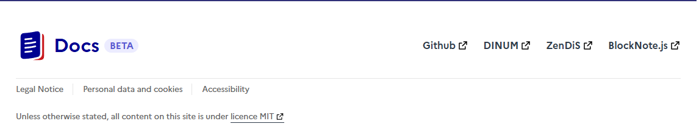

# Runtime Theming 🎨

### How to Use

To use this feature, simply set the `FRONTEND_CSS_URL` environment variable to the URL of your custom CSS file. For example:

```javascript
FRONTEND_CSS_URL=http://anything/custom-style.css
```

Once you've set this variable, our application will load your custom CSS file and apply the styles to our frontend application.

### Benefits

This feature provides several benefits, including:

*   **Easy customization** 🔄: With this feature, you can easily customize the look and feel of our application without requiring any code changes.
*   **Flexibility** 🌈: You can use any CSS styles you like to create a custom theme that meets your needs.
*   **Runtime theming** ⏱️: This feature allows you to change the theme of our application at runtime, without requiring a restart or recompilation.

### Example Use Case

Let's say you want to change the background color of our application to a custom color. You can create a custom CSS file with the following contents:

```css
body {
  background-color: #3498db;
}
```

Then, set the `FRONTEND_CSS_URL` environment variable to the URL of your custom CSS file. Once you've done this, our application will load your custom CSS file and apply the styles, changing the background color to the custom color you specified.

----

# **Footer Configuration** 📝

The footer is configurable from the theme customization file.

### Settings 🔧

```shellscript
THEME_CUSTOMIZATION_FILE_PATH=<path>
```

### Example of JSON

The json must follow some rules: https://github.com/suitenumerique/docs/blob/main/src/helm/env.d/dev/configuration/theme/demo.json

`footer.default` is the fallback if the language is not supported.

--- 
Below is a visual example of a configured footer ⬇️:



----

# **Custom Translations** 📝

The translations can be partially overridden from the theme customization file.

### Settings 🔧

```shellscript
THEME_CUSTOMIZATION_FILE_PATH=<path>
```

### Example of JSON

The json must follow some rules: https://github.com/suitenumerique/docs/blob/main/src/helm/env.d/dev/configuration/theme/demo.json